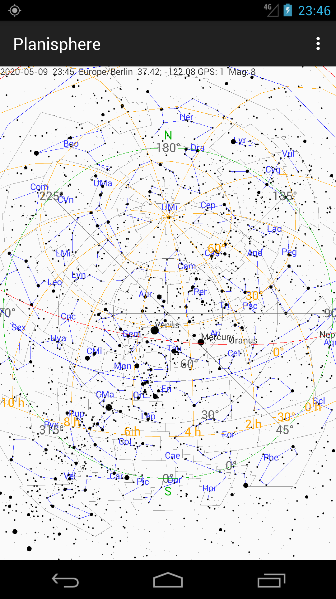

# AndroidPlanisphere

A simple star chart that shows stars, constellations and planets.

The App shows:

- over 9000 stars
- constellation lines, boundaries and names
- planets of the solar system
- azimuthal grid
- equatorial grid
- horizon
- ecliptic
- celestial equator

The App works on every place of the earth. An Internet connection is not
required. The location can be entered manually or is provided by the
device. There are several options to enable and disable elements of the
chart, select the maximum apparent magnitude, choose the color theme and set the
date and time.

## Screenshots

## Third-party components

This software incorporates the following third-party components:

* bs_catalog.txt, bs_notes, bs_readme  
  The Bright Star Catalogue,  5th Revised Ed. (Preliminary Version), Hoffleit
  D., Warren Jr W.H. (Astronomical Data Center, NSSDC/ADC, 1991)
  http://cdsarc.u-strasbg.fr/viz-bin/Cat?V/50

* constellation_lines.dat  
  Copyright (c) 2005-2020, Marc van der Sluys, http://hemel.waarnemen.com,
  CC BY-SA 4.0, https://github.com/hemel-waarnemen-com/Constellation-lines

* constellation_names.txt  
  The Constellations, International Astronomical Union,
  https://www.iau.org/public/themes/constellations/  
  Wikipedia, Liste der Sternbilder, https://de.wikipedia.org/wiki/Liste_der_Sternbilder

* horizons_jupiter.csv, horizons_neptune.csv, horizons_saturn.csv, horizons_uranus.csv  
  Jet Propulsion Laboratory, HORIZONS System, https://ssd.jpl.nasa.gov/?horizons

* calculations based on  
  Montenbruck O.; Grundlagen der Ephemeridenrechnung; Spektrum Akademischer
  Verlag, München, 7. Auflage (2005)
