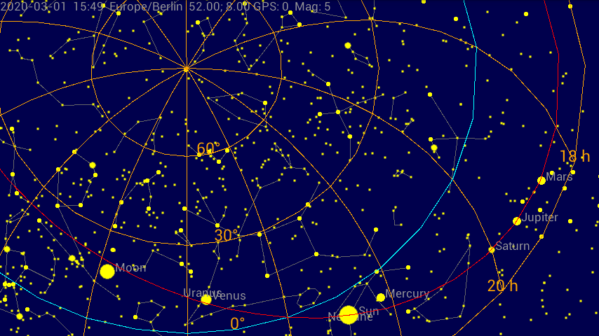

# AndroidPlanisphere

A simple star chart that shows sun, moon and stars as well as constellations and planets.

The app shows the sky for an user defined point of time and an arbitrary location on the earth:

- sun and moon
- over 9000 stars
- constellation lines
- constellation names in English, Latin or as abbreviation
- constellation boundaries
- all eight planets of the solar system
- azimuthal grid
- equatorial grid
- horizon
- ecliptic
- celestial equator

The location can be entered manually or is provided by the device. There are
several options to enable or disable elements of the chart, select the maximum
apparent magnitude or choose the color theme. No Internet connection required.

## Download

## Screenshots

## Third-party components

This software incorporates the following third-party components:

* bs_catalog.txt, bs_notes, bs_readme  
  The Bright Star Catalogue,  5th Revised Ed. (Preliminary Version), Hoffleit
  D., Warren Jr W.H. (Astronomical Data Center, NSSDC/ADC, 1991)
  http://cdsarc.u-strasbg.fr/viz-bin/Cat?V/50

* constellation_lines.dat  
  Copyright (c) 2005-2020, Marc van der Sluys, http://hemel.waarnemen.com,
  CC BY-SA 4.0, https://github.com/hemel-waarnemen-com/Constellation-lines

* constellation_names.txt  
  The Constellations, International Astronomical Union,
  https://www.iau.org/public/themes/constellations/  
  Wikipedia, Liste der Sternbilder, https://de.wikipedia.org/wiki/Liste_der_Sternbilder

* star_names.txt  
  Naming Stars, International Astronomical Union,
  https://www.iau.org/public/themes/naming_stars/

* horizons_jupiter.csv, horizons_neptune.csv, horizons_saturn.csv, horizons_uranus.csv  
  Jet Propulsion Laboratory, HORIZONS System, https://ssd.jpl.nasa.gov/?horizons

* calculations based on  
  Montenbruck O.; Grundlagen der Ephemeridenrechnung; Spektrum Akademischer
  Verlag, München, 7. Auflage (2005)
